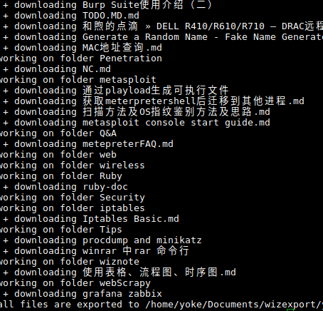

# 为知笔记python-exporter

大部分源码是借助网上github源码,这里由于一些原因没有直接引用原作者地址,当然你可以从源码中看到原始文件的出处.
该程序主要是为了导出所有为知笔记,以便于备份笔记(由于免费帐号过了试用期不再提供同步服务原因)

`开发/测试环境: ubuntu 16.10 python2.7.12+`

我仅仅在linux上面测试过,至于windows 上如果报错,大部分可能会因为文件命名规则.

## 使用

### 下载所有源码

 `git clone https://github.com/yoke88/wiznoteExporter.git`


### 更改test.py
 ```
  wizUsername='YourWiznoteAccountName'
  wizPassword='wiznotePassword'
 ```

### 执行test.py
 linux 下直接cd 到wiznoteExporter ,然后执行`./test.py`即可
 windows 下你可能需要先安装python2.7 ,然后步骤同上.
 

### screenshot
 

### 其他手动办法

其实wiznote的数据在本地有缓存,linux 放在`~/.wiznote/yourWiznoteAccountName/data/notes`目录下面,都是{GUID}的方式存放
这些文件其实是zip文件,每个文件里面包含html ,图片以及元数据.

元数据`meta.xml`包含了每个note的相关信息,如title,description

当然如果你需要更详细的信息,你可能需要使用sqllite 等工具看下`~/.wiznote/yourWiznoteAccountName/data/index.db`文件
